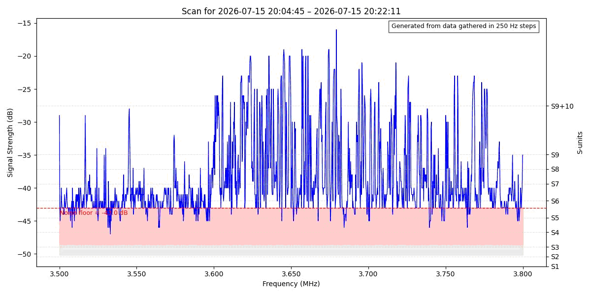

# Scanner — HF Sweep Engine & Panoramic Plotting

Scanner is a CAT‑controlled HF sweep engine written in Perl, with Python tools for panoramic sweep plotting. It performs frequency sweeps, samples the rig’s S‑meter, and stores results as timestamped CSV files for later analysis.

---

## Features

- CAT‑controlled HF sweep engine (`perl/scanner.pl`)
- GUI input for sweep parameters (start/stop frequency, step size)
- Timestamped CSV logging with S‑meter sampling
- Python panoramic sweep plotting (`python/plot_sweep.py`)
- Architecture diagrams (`docs/`)
- Example sweep datasets (`examples/`)
- MIT‑licensed

---

## Repository structure

```text
scanner/
│
├── perl/
│   └── scanner.pl
│
├── python/
│   ├── plot_sweep.py
│   └── scanner_block_diagram.py
│
├── examples/
│   ├── 80m_sweep.csv
│   └── 40m_sweep.csv
│
├── docs/
│   ├── scanner_block_diagram.png
│   └── scanner_hamlib_diagram.png
│
├── README.md
├── LICENSE
├── CHANGELOG.md
└── VERSION
```

---

## Requirements

### Perl
- Perl 5.x  
- Hamlib (optional, for rig control)
### Perl modules

Scanner uses several Perl modules which may not be installed by default.  
Use CPAN to install any missing modules:

```bash
cpan install Tk Time::HiRes IO::Socket::INET Time::HiRes qw(usleep) POSIX qw(strftime) IO::Handle Cwd Win32 Win32::GUI;
```

### Python
- Python 3.x  
- pandas  
- matplotlib

Install Python dependencies:

```bash
pip install pandas matplotlib
```

## How the GUI Works

When you run `scanner.pl`, a GUI window appears prompting you for the sweep parameters:

- **Start Frequency**  
- **Stop Frequency**  
- **Step Size**

These values define the sweep range and resolution.

### Sweep Process

Once you click **Continue**:

1. The script controls the rig via CAT.
2. Frequencies are stepped according to your chosen interval.
3. The dB value is sampled at each step.
4. Results are written to a timestamped CSV file.

Example output:
docs/2026-08-22_40m_sweep.csv

The GUI ensures sweep parameters are always entered correctly and avoids hard‑coding values in the script.

## Troubleshooting CAT/COM Ports

CAT control depends on correct serial port configuration. If the sweep does not start or the rig
does not respond, check the following:

### 1. Confirm the correct COM port
On Windows:

- Open **Device Manager**
- Expand **Ports (COM & LPT)**
- Identify the COM port used by your rig (e.g., `COM3`, `COM5`)

Update the script or GUI settings accordingly.

### 2. Check rig CAT settings
Ensure:

- CAT is enabled on the rig
- Baud rate matches the script
- Stop bits, parity, and flow control match your rig’s documentation

### 3. Close other CAT applications
Only one program can access the COM port at a time. Close:

- Hamlib/rigctl
- FLRig
- WSJT‑X
- Any logging software using CAT

### 4. Permissions (Windows)
If the script cannot open the COM port:

- Run the terminal as **Administrator**
- Ensure no antivirus is blocking Perl scripts

### 5. Win32::SerialPort issues
If CPAN reports missing modules:

```bash
cpan install Win32::SerialPort
```

---

# ⭐ 3. **Example Plot**

Below is an example panoramic sweep plot generated using `plot_sweep.py`:



This plot shows signal strength across the band, with frequency on the x‑axis and S‑meter values on the y‑axis.

---

## Contributing

Contributions are welcome. The repository includes structured GitHub issue templates to help
maintainers and users report problems or request enhancements.

### Issue Types

- **Bug Report** — for problems with the sweep engine or plotting tools  
- **Feature Request** — for new capabilities or improvements  
- **Data Issue** — for sweep CSV or plot anomalies

### Pull Requests

If submitting code changes:

1. Fork the repository  
2. Create a feature branch  
3. Commit changes with clear messages  
4. Submit a pull request describing the change

### Code Style

- Perl: follow `strict` and `warnings` conventions  
- Python: PEP‑8 style preferred  
- Include comments for non‑obvious logic  
- Provide example data when relevant

### Testing

Before submitting:

- Run a sweep using the GUI  
- Verify CSV output  
- Generate a plot using `plot_sweep.py`  
- Confirm no regressions in existing functionality

---

